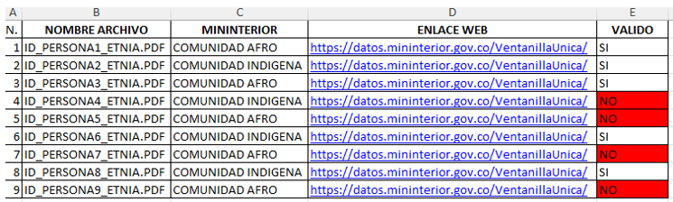

# CLASIFICACIÓN-Y-VALIDACIÓN-DE-CERTIFICADOS-DE-GRUPOS-ETNICOS

## Descripción

Este proyecto implementa un pipeline en Python para automatizar la clasificación, validación y autenticación de documentos PDF relacionados con certificaciones de grupos étnicos del Ministerio del Interior. Combina técnicas de procesamiento de texto, modelado predictivo y web scraping para validar la autenticidad de los documentos y verificar su respaldo con las entidades oficiales.

## Objetivo Principal

Identificar si los documentos cargados son válidos, si han sido autenticados mediante las páginas oficiales, y determinar quiénes han subido documentos válidos y respaldados por verificaciones oficiales.

## Características Principales

1. **Extracción de texto de documentos PDF**:
   - Utiliza bibliotecas como `PyPDF2`, `pytesseract` y `pdf2image` para extraer texto de archivos PDF de diferentes formatos y calidades.

2. **Procesamiento y vectorización del texto**:
   - Limpieza y preprocesamiento de texto con `nltk` (incluyendo eliminación de stopwords y normalización).
   - Vectorización del texto mediante técnicas como TF-IDF para generar una matriz lista para clasificación.

3. **Clasificación mediante modelo XGBoost**:
   - Uso de un modelo previamente entrenado con XGBoost para clasificar los documentos según su validez (válido/no válido).
  
     
     

4. **Web scraping para autenticación**:
   - Extracción de enlaces desde los documentos clasificados como válidos.
  
     

     
   - Validación de los documentos mediante scraping de páginas oficiales para verificar su autenticidad.
  

<video width="600" controls>
  <source src="ejemplo_web_scraping.mp4" type="video/mp4">
  Tu navegador no soporta el elemento de video. Puedes [descargarlo aquí](ejemplo_web_scraping.mp4).
</video>

5. **Reporte y análisis**:
   - Generación de reportes que indican:
     - Quiénes han cargado documentos válidos.
     - Cuáles documentos "válidos" tienen respaldo oficial.
    
     

## Principales Dependencias

- `PyPDF2`
- `pdf2image`
- `pytesseract`
- `Pillow`
- `pandas`
- `nltk`
